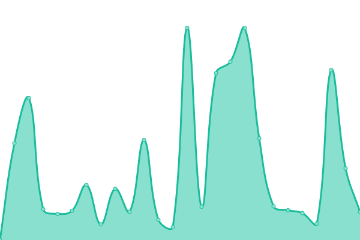
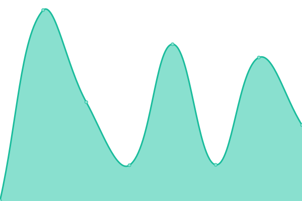
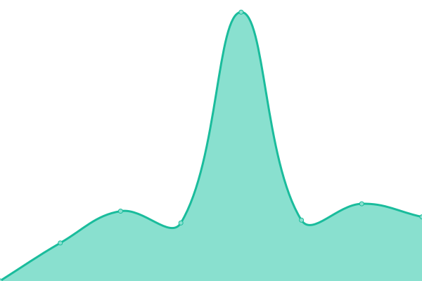

This repository contains the open-source uptime monitor and status page for [Richard Hu](hzk.is-a-good.dev), powered by [Upptime](https://github.com/upptime/upptime).

> [!NOTE]
>
> ### [📈 网站状态](https://PowerfulRichard.github.io/PT-Status): <!--live status--> **🟧 部分网站离线**

<!--start: status pages-->
<!-- This summary is generated by Upptime (https://github.com/upptime/upptime) -->
<!-- Do not edit this manually, your changes will be overwritten -->
<!-- prettier-ignore -->
| 链接 | 状态 | 历史 | 响应时间 | 正常运行时间 |
| --- | ------ | ------- | ------------- | ------ |
|  CHDBits | 🟩 正常运行 | [chd-bits.yml](https://github.com/PowerfulRichard/PT-Status/commits/HEAD/history/chd-bits.yml) | 

 9毫秒
     
 | 

<a href="https://pt-status.hurl.live/history/chd-bits">100.00%</a>
    

|  馒头/M-Team | 🟩 正常运行 | [m-team.yml](https://github.com/PowerfulRichard/PT-Status/commits/HEAD/history/m-team.yml) | 

 374毫秒
     
 | 

<a href="https://pt-status.hurl.live/history/m-team">98.71%</a>
    

|  TTG | 🟩 正常运行 | [ttg.yml](https://github.com/PowerfulRichard/PT-Status/commits/HEAD/history/ttg.yml) | 

 544毫秒
     
 | 

<a href="https://pt-status.hurl.live/history/ttg">98.40%</a>
    

|  天空/HDSky | 🟩 正常运行 | [hd-sky.yml](https://github.com/PowerfulRichard/PT-Status/commits/HEAD/history/hd-sky.yml) | 

 689毫秒
     
 | 

<a href="https://pt-status.hurl.live/history/hd-sky">99.29%</a>
    

|  春天/CMCT/SSD | 🟩 正常运行 | [cmct-ssd.yml](https://github.com/PowerfulRichard/PT-Status/commits/HEAD/history/cmct-ssd.yml) | 

 420毫秒
     
 | 

<a href="https://pt-status.hurl.live/history/cmct-ssd">99.29%</a>
    

|  GreatPostWall(GPW) | 🟩 正常运行 | [great-post-wall-gpw.yml](https://github.com/PowerfulRichard/PT-Status/commits/HEAD/history/great-post-wall-gpw.yml) | 

 957毫秒
     
 | 

<a href="https://pt-status.hurl.live/history/great-post-wall-gpw">98.38%</a>
    

|  朋友/FRDS | 🟩 正常运行 | [frds.yml](https://github.com/PowerfulRichard/PT-Status/commits/HEAD/history/frds.yml) | 

 345毫秒
     
 | 

<a href="https://pt-status.hurl.live/history/frds">99.42%</a>
    

|  HDArea | 🟩 正常运行 | [hd-area.yml](https://github.com/PowerfulRichard/PT-Status/commits/HEAD/history/hd-area.yml) | 

 8413毫秒
     
 | 

<a href="https://pt-status.hurl.live/history/hd-area">91.40%</a>
    

|  HDAtoms | 🟥 网站离线 | [hd-atoms.yml](https://github.com/PowerfulRichard/PT-Status/commits/HEAD/history/hd-atoms.yml) | 

 0毫秒
     
 | 

<a href="https://pt-status.hurl.live/history/hd-atoms">0.00%</a>
    

|  HDFans | 🟩 正常运行 | [hd-fans.yml](https://github.com/PowerfulRichard/PT-Status/commits/HEAD/history/hd-fans.yml) | 

 433毫秒
     
 | 

<a href="https://pt-status.hurl.live/history/hd-fans">81.71%</a>
    

|  HDHome | 🟩 正常运行 | [hd-home.yml](https://github.com/PowerfulRichard/PT-Status/commits/HEAD/history/hd-home.yml) | 

 204毫秒
     
 | 

<a href="https://pt-status.hurl.live/history/hd-home">100.00%</a>
    

|  KamePT | 🟩 正常运行 | [kame-pt.yml](https://github.com/PowerfulRichard/PT-Status/commits/HEAD/history/kame-pt.yml) | 

 13毫秒
     
 | 

<a href="https://pt-status.hurl.live/history/kame-pt">100.00%</a>
    

|  海胆/Haidan | 🟩 正常运行 | [haidan.yml](https://github.com/PowerfulRichard/PT-Status/commits/HEAD/history/haidan.yml) | 

 322毫秒
     
 | 

<a href="https://pt-status.hurl.live/history/haidan">98.69%</a>
    

|  PT-Time | 🟩 正常运行 | [pt-time.yml](https://github.com/PowerfulRichard/PT-Status/commits/HEAD/history/pt-time.yml) | 

 17毫秒
     
 | 

<a href="https://pt-status.hurl.live/history/pt-time">100.00%</a>
    

|  Femdomcult | 🟩 正常运行 | [femdomcult.yml](https://github.com/PowerfulRichard/PT-Status/commits/HEAD/history/femdomcult.yml) | 

 107毫秒
     
 | 

<a href="https://pt-status.hurl.live/history/femdomcult">100.00%</a>
    

|  GT-Org | 🟩 正常运行 | [gt-org.yml](https://github.com/PowerfulRichard/PT-Status/commits/HEAD/history/gt-org.yml) | 

 649毫秒
     
 | 

<a href="https://pt-status.hurl.live/history/gt-org">98.69%</a>
    

|  GTru | 🟩 正常运行 | [g-tru.yml](https://github.com/PowerfulRichard/PT-Status/commits/HEAD/history/g-tru.yml) | 

 1504毫秒
     
 | 

<a href="https://pt-status.hurl.live/history/g-tru">98.28%</a>
    

|  TorrentLeech | 🟩 正常运行 | [torrent-leech.yml](https://github.com/PowerfulRichard/PT-Status/commits/HEAD/history/torrent-leech.yml) | 

 895毫秒
     
 | 

<a href="https://pt-status.hurl.live/history/torrent-leech">97.99%</a>
    

<!--end: status pages-->

[**Visit our status website →**](https://PowerfulRichard.github.io/PT-Status)
